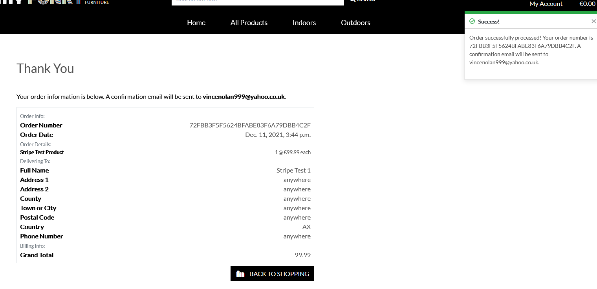
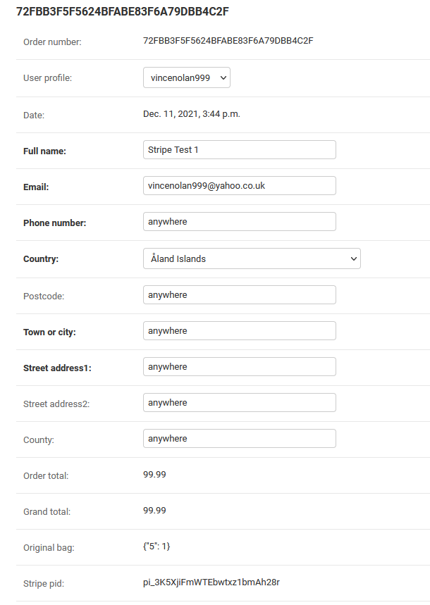
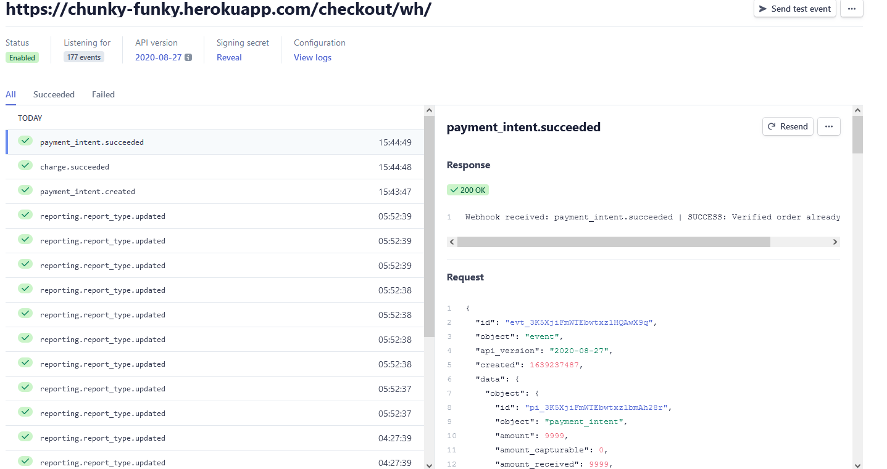
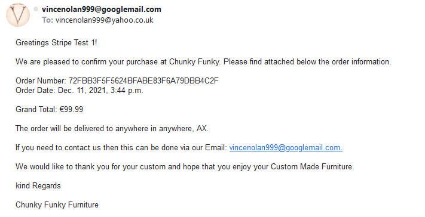
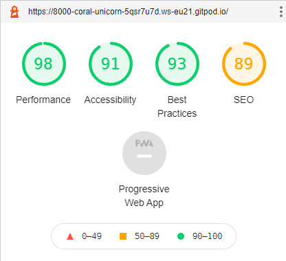
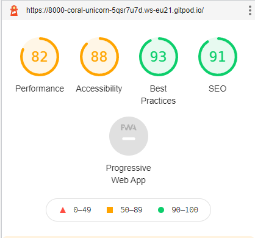

# Chunky Funky Furniture

### [Link to Live Heroku hosted website](https://chunky-funky.herokuapp.com/)

## <u>Screenshots</u>

 

## A Python and Data Centric Development Project

- This is my Forth and final Milestone Project with Code Institute. Its purpose is to build a Full Stack Frameworks with Django site that allows users to purchase goods using a tested authentication procedure to prevent users bypassing the sites security mechanisms.  I have chosen a Custom furniture shop where users are able to view and purchase items.

---
## <u>Table of Contents</u>
- [Screenshots](#screenshots)
- [UX](#UX)
    - [User goals](#user-goals)
    - [User stories](#user-stories)
    - [Structure of the website](#structure-of-the-website)
- [Features](#features)
- [Technology Used](#technology-used)
- [Testing](#testing)
    - [Functionality testing](#functionality-testing)
    - [Compatibility testing](#compatibility-testing)
    - [Code Validation](#code-validation)
    - [User stories testing](#user-stories-testing)
    - [Issues found during site development](#issues-found-during-site-development)
    - [Performance testing](#performance-testing)
- [Deployment](#deployment)
- [Credits](#credits)
 
 ---
## <u>UX</u>

  - The aim of this website is to be a E-commerce store for a fictional Custom made furniture shop which users can browse products and purchase.

### User Stories

#### Unregistered User

  - To understand the intent and purpose of the site.
  - For the site to be useable on different devices
  - to learn more about the company and its history.
  - to view a catalog of products the company is selling
  - ability to add products to a shopping bag 
    - ability to increase or decrease the items in the shopping bag.
    - ability to remove items.
  - a system to purchase the items securely
  - to receive confirmation via onscreen prompts and also Emails.
  - To be able to register so my details are stored for future purposes.
  
#### Registered User

  - To Sign in and Out of my account.
  - To recover my password if forgotten
  - be able to view and edit my details 
  - A system to see my previous orders and contents.
  - For my saved delivery details to populate the forms where required.

#### Site Owner/Admin

  - To showcase the products the company makes and sells.
  - to be able to edit and delete products.
  - to be able to add new products.
  - I want users to be able to make purchases safely and securely
  

### Structure of the website

- I want the website to be easily accessible, simple to navigate and user friendly. It must also be displayed 
  for various devices (desktop ,Tablet, Mobile Phone) whilst maintaining a great user experience . Links within the website taking me to other features

#### Database Schema

---
## <u>Features</u>

- Site is made using Django which is a large feature packed framework
- Django has built in account creation features. This enables emails to be sent to verify details as well as forgotten passwords.
- Products are stored in a PostgresSQL database and can be easily viewed by the user.
- products can be searched for via a search bar or a series of drop down selections.
- The site conforms to the principles of CRUD.  The site owner can Create, update and delete products that all users can read.
- A payment handler named STRIPE is used to facilitate a safe and secure payment system for the user.
- Previous orders and delivery details are saved on the users profile.
- A bootstrap 'Toast' system is used to show messages in relation to the users or site owners actions.  Eg. adding products to there bag or updating products.

#### Fonts

- The main font used is 'lato'  [Google-fonts](www.fonts.google.com)
   - Logo fonts of Bunge and  Monoton used. (also google fonts)

#### Images

- Images are saved within the AWS cloud storage service. 

- Background Image of main landing page obtained Adam Patterson on Unsplash

#### Navbar and footer

- Interactive Navigation bar and footer

- Navbar located at top with brand name to the left and a responsive menu on the right for the account section.
    - When not logged in it displays the options of Login and Register. 
    - Logged in for a user will show options of profile and Logout. 
    - Logged in as a superuser will reveal the product management section that allows the adding of products.
    - Logging in Removes login/register and replaces with logout.
- Shopping bag and Value amount - Links to Users shopping Bag.

#### Search section

- A selection of Buttons allowing searches by product type, split into two main categories of Indoors and Outdoors furniture (each has there own product category types revealed within). An all products link which can sort the products by Price, Rating and Category.

- A search bar allowing searches by Product name or description text.

- On mobile view the search categories are available as a Hamburger Drop down menu

#### Hero Image

- Fixed image wood workshop.

- Call to action 'goto shop' button for quick link to the products page.

- Footers located at the bottom with placeholder links to social media sites. In addition there is a section about the company.

#### Toast Message display area. 

- To the top right, toast message will appear depending on actions. They are in 4 categories: Success, Info, warning and Error.
    - Success: Product updated, product added to bag, removed from bag, order processed, admin product added/updated/deleted. Profile updated
    - Info: admin editing product and viewing of previous order in profile
    - warning:  notification for admin that stripe public key not set.
    - Error: Removing item from bag failed, payment failure, product not found, failed to add product, checkout form not completed correctly,
        search box empty,  admin failed to update product. 

#### Profile Page

-  Profile page displaying the username and delivery address details of the user. The address is displayed as a form and can be edited and updated. Username cannot be changed.  In addition the profile page displays the users previous orders,  this links to the order which contains information to that order including, date, product purchased , delivery address and Grand total.  A toast is also shown specifying that this is a previous purchase made.

#### Product Page

- A grid style layout of the stores products. number of items displayed is dependant on screen size.
- A sort button with various options . eg by name or price etc.
- While admin user the addition of Edit and delete buttons
- clicking product will goto a product overview that contains further details. 
    - option to add this product to the shopping bag and a quantity selector.
    - option to return back to the products page.

#### Shopping Bag

-  produces a visual list of the items and quantity's entered by the users.
-  allows users to update or delete the order
-  a breakdown of costs per item and a grand total of all products.
-  a link to goto a 'checkout' section or continue shopping.

#### Checkout Section

- A section that summaries the users intended purchase and the total.
- A form that allows users to enter there delivery details.
- User logged in will pre populate the form with the details stored in the profile form.
- Anonymous users will be able register or login if they choose. Or continue without having to register.
- logged in users can notify if the details entered should update there profile details.
- A payment system powered by stripe.
- confirmatory button to complete the order or return to the shopping bag section.

#### Future Features 

- Facility for users to log in via existing social media accounts. 
- contact form for queries.
- review page for users.
- News section that will email existing customers new products.
- display images via URL.
- Slide show of images or more images in the product detail view.

[Back to Table of contents](#table-of-contents)

---
## <u>Technology Used</u>

* [Django](https://www.djangoproject.com/)

  - Django is a high-level Python web framework that encourages rapid development and clean, pragmatic design

* [Amazon S3 via AWS](https://aws.amazon.com/)
  
  -  Object storage built to store and retrieve any amount of data from anywhere

* [Heroku](https://www.heroku.com/)

  - cloud platform for project deployment

* [Python](https://www.python.org/)

  - programming language. Utilizing the following tools:
  - Pymongo used to link python with mongo DB
  - Werkzeug password hash and username.

* [HTML5](https://en.wikipedia.org/wiki/HTML5)

  - Main Programming language

* [CSS](https://en.wikipedia.org/wiki/CSS) 

  - Style sheet language

* [JS](https://www.javascript.com/)

  - Used to create interactive functionality

* [Jquery](https://jquery.com/)

  - JavaScript library

* [Google Fonts:](https://fonts.google.com/)

  - Used to import custom fonts

* [Icons:](https://fontawesome.com/) 

  - Used to import icons

* [GitHub:](https://www.github.com.com)

  - Used to store projects created in gitpod. 

* [Gitpod:](https://www.gitpod.io.com)

   - Used to develop the project, including version control (using commits and comments.)
 
* [windows Photo editor](https://www.microsoft.com/en-us/p/photo-editor-for-windows-10/9mzwk7vt6b3g?activetab=pivot:overviewtab)

   - Basic photo editor

[Back to Table of contents](#table-of-contents)

---
## <u>Testing</u>

Continuous ongoing testing during development to ensure functions working correctly and as intended.
Below is final manual test regime conducted on the deployed site on Heroku to ensure that the site is working as intended.

### User Not logged In
- Navbar 
    - My account button correctly shows register and login
    - login reveals a sign in page for username and password
    - remember me button to store the details.
    - home button returns to the home page.
    - if valid credentials added to sign in then users is correctly logged in and toast message displayed.
    - option to sign up for an account present that redirects to a sign up page.
    - register/signup page form correct and works as intended.

    - checkout bag takes direct to shopping bag. The value is responsive if items added or removed.
    - search box present and button correct
    - On mobile the search button opens up the search bar in a drop down menu
    - On mobile a hamburger menu is present for the relevant categories.
    - search button correct and filter as desired.
    - GOTO SHOP button links directly to the property pages

- Footer 
    - All links open there relative pages in a new tab.

- Search Section
  - all product selection options correctly filter as intended and return the desired product views.
  - dropdown selection on products show correctly
  - Product filters collapse to a hamburger menu on mobile view and work correctly
  - sort by filter works as intended

- Products page
  - displayed as intended or filtered. Number of products on page depends on screen size, scales from between 1 and 4 products. Images and product details clearly visible. If no Image a stock 'no photo' picture present.
    placeholder image.
  - No access to edit or delete option meant for the admins.

- Product information page.
  - large image present as well as product details with a expanded description.
  - quantity buttons present to increase or decrease the amount with a visible count in the middle. 
  - product limit is set between 1 and 99.  Use of buttons to go outside of this range is not possible. Manually putting in a number that is not in 
  this range brings a pop up error
  - keep shopping button links back to the product page.
  - add to bag button correctly adds the selected quantity of the product to the bag. A Success toast message at top right appears with the correct product with a link to goto a secure checkout. Toast dismiss button works correctly, and link to checkout takes to the checkout page.
  - works as expected in all device views.
  - adding multiple different items works as intended. checkout total changes accordingly.
  
- Shopping Bag
  - List of products added to the bag is present with price and quantity shown correctly and then a subtotal for each product.
  - quantity button present which works in same was as the add product.  Addition buttons of Update and remove buttons present. 
  - update button changes the quantity correctly and sub total changes. A success toast appears updated in the bag.
  - remove button correctly removes that product from the list regardless of the quantity. A toast success present stating the product has been removed.
  - Product grand total present at bottom of screen which correctly shows the amounts. 
  - Keep shopping button which return to the products page
  - Secure checkout button that directs to the checkout page. 

- Checkout 
  - a form is present with fields to capture name, email and delivery address.
  - correct order summary shown.
    - required fields work as intended and are not allowed to be left blank. valid email required.
  - option to create an account to save order information.  
  - Users can remain anonymous.
  - payments card area.
  - adjust bag button redirect back to shopping bag.
  - complete order button processes the order if all required Fields completed.

  - a confirmation page shows on completion of checkout form with the correct products and details entered by the user. A toast stating the order has been processed along with a order number.
  - In Django admin the order is present and correct.
  - on stripe the webhooks are successful. Charge.succeeded and  Payment_intent.succeeded which verified that the order is in the database.
  - During testing of the stripe webhook feature and form submission errors the following test was created and verified.
    - In the checkout/static/checkout/js/stripe_elements.js  File line 110 (form.submit();) was commented out/deleted. This would in effect prevent the checkout form being sent to the Django database correctly.  The webhook handler from stripe then correctly checked that the order was not in the database and created the order. This acts as a backup to ensure that orders are created successfully even if there is a failure in the form submission.

### User Logged In 
  All the above tests completed whilst logged in. Below is the additional option available to logged in users and any additional features.

- Navbar 
  - 

- Log out
  - session cookie is removed. No access to other features.
  - toast message confirming 'you are now logged out'

- Profile Section.
  - pressing takes you to the profile page
  - Displays the users name and the default delivery information which can be amend by the user. Pressing the Update information button does as it says..
  - Order history present and display correctly. Clicking on the order brings up a summary and notifies that this was a previous order.

- Checkout
  - The procedure is the same as above for Not logged in users.  T
  - The form is now pre filled with the correct user deliver details
  - the option to save the delivery details to the profile via a checkbox. 
  
### Admin Logged In 
  All the above tests created.  The only additional features for admin is in regards to the adding, editing or deleting product's.

- Navbar
  - Product management option available in My Account
  - On logout this is removed and no access to this feature And toast present stating logged out.

- Product Management page 
  - Form 'required' sections working correctly
  - adding images tested. Bug found with displaying URL only images. see issues found section. Adding images by choosing a file works correctly
  - creating a product returns admin to the Product detail form and all info is displayed correctly. Navigating to the main product page and New item present.
    item also present in database.
  - cancel button direct back to product page.
  
- Products Page
  - Extra buttons available of Edit and Delete.  
    - Edit button directs to the product management form with the products details fully completed. Editing works as intended.
    - Delete button removes the item from the product page and database.

### Order Verification testing

- Checkout Success

- Django Order in Admin section 

- Confirmation of Stripe webhook success.

- Email verification of order to user

### Functionality testing

- chrome Browser used to run Gitpod and developer tools used to test , solve problems, style and responsiveness.
Chrome developer tools used to check compatibility during project and to check on consistency.

- Mozilla Dev tools used to test in addition to chrome dev tools.    

- No issues detected.

### Compatibility testing

- I have tested the website on the virtual devices (including landscape orientation) contained with the Dev Tools of Mozilla and Chrome with no 
issues seen on either. A wide range of screen sizes tested from mobile, tablet and desktop.

- I have tested compatibility on the heroku published website of the project on a 1920 x 1080 monitor, a galaxy s7 
and a Motorola  one+ mobile phone with no issues noted

- The website was submitted for peer review and no Issues were mentioned

### Code Validation

-  https://jigsaw.w3.org/css-validator/   

    - This document validates as CSS level 3 + SVG.  Tested on each specific app address (products, bag etc) 

-  https://validator.w3.org/

    -  passes except for script type="text/javascript".  I have left these unchanged for legacy browsers.

-  https://wave.webaim.org/ - A web accessibility checker

    - Checked on all major pages. Showed 2 errors in connection with a missing label on the search bar and the empty button associated with it. I have left this as is as I have included text in the button and also an aria-label.  no other errors or issues.

-  Pep8 validation.  This was completed using "python3 -m flake8" in the terminal interface. 

    - The code was refactored.  Most queries that remain are in the migrate or built in files.  The remaining items are mostly line too long for which I decided to leave as they were for readability purposes.

### User stories testing

#### Unregistered User

  - To understand the intent and purpose of the site.
    - It is evident what the e-commerce site is selling
  - For the site to be useable on different devices
    - Responsive for all device sizes
  - to learn more about the company and its history.
    - A brief section about the company present on the home page
  - to view a catalog of products the company is selling
    - A functional product page present that allows users to view them in more detail if required.
  - ability to add products to a shopping bag 
    - A shopping bag is present and products can be added, updated or removed from this bag.

  - ability to increase or decrease the items in the shopping bag.
    - Product quantity can be altered as desired between a set minimum and maximum (1-99)
  - ability to remove items.
    - Remove item from Bag option present.
  - a system to purchase the items securely
    - This is made available via Stripe which is a 3rd party payment system.
  - to receive confirmation via onscreen prompts and also Emails.
    - Toast Notification are present to further confirm the users actions. Personal emails can also be sent in regards to the account options (registration/ lost passwords etc.)  In addition an order confirmation is sent to the users designated email address with an order summary.
  - To be able to register so my details are stored for future purposes.
    - A full built in accounts system via django auth is included in the site. This contains many pre installed services like login and logout to name a few.
  
#### Registered User

  - To Sign in and Out of my account.
    - This is Present.
  - To recover my password if forgotten
    - Password recovery via email is included via the built in django services
  - be able to view and edit my details 
    - This has been included in the profile section.
  - A system to see my previous orders and contents.
    - This is also included in the users profile section and a list is available of past order. Selecting an order link will bring up the order summary similar to the confirmation of order email.
  - For my saved delivery details to populate the forms where required.
    - Once the information is added into the profile form and the user remains logged in, when the user goes to the checkout page the form is pre populated. 
    the user also has the option to update the delivery information if they choose to in the checkout page.

#### Site Owner/Admin

  - To showcase the products the company makes and sells.
    - A responsive product page is present which contains the company's products it sells. 
  - to be able to edit and delete products.
    - Admins are able to update and delete existing products.
  - to be able to add new products.
    - A product management page present that allows the admin to add additional products.
  - I want users to be able to make purchases safely and securely
    - Stripe payment method has been included in the checkout section of the website, this has its own built in security features.

### Issues found during development and testing

  - Checkout page not displaying correctly on mobile view.  To address this issue I created a mobile only view by using bootstrap display- none and block commands at certain break points. This worked as a good fix for the code, however a problem with the increment buttons was present. I decided to remove these as the mobile view was presented differently and this was the cleanest and quickest fix.

  - During the deployment of the project to Heroku, Gitpod has changed the installed apps that show in the requirements.txt.  This has caused Over 100+ entries into the req's file. In addition to this upon restart of the gitpod repository several apps require to be reinstalled each time via a terminal. However once this is done the site runs correctly on gitpod.  Testing has shown that this causes no issues with heroku (albeit a rather large Req's file.).  I was left with several options from cloning the repo to creating a new branch.  This possibly could effect the continuity of the course material, So I have decided to leave the changes made by gitpod. To minimize the impact I created a copy of the actual required Requirements.txt file (named _copy),  and also a separate file of the dependencies that I need to reinstall every time the gitpod server is started.  This is a simple terminal command of "pip3 install -r reinstall.txt" . Although not ideal, at so close to submission deadline, with no other adverse effects present this was my safest option and the deployment via Heroku appears to be un-affected. 

  - During testing I found that it was not possible to display product images by the URL field in the form. I tried several remedies to fix,  Extra elif fields in the product view to name one.  Due to time constraints I decided to remove this from the form. This was done by removing the respective product field in the products.models.py file. No impact on the website other than that field no longer present and the Django database changed to reflect this. Migrations made as a result. 

### Performance testing

  - I have used [Lighthouse](https://developers.google.com/web/tools/lighthouse/) for the performance testing. No relevant errors present. Screen shots of the result are shown below.

#### Desktop performance

#### Mobile Performance

[Back to Table of contents](#table-of-contents)

---
## <u>Deployment</u>

Github used as version control for this project with deployment of the website via Heroku.

To deploy the project you will first need to clone the repository located at github.

A full walk-through from github is available here [cloning a repository](https://docs.github.com/en/github/creating-cloning-and-archiving-repositories/cloning-a-repository-from-github/cloning-a-repository)

- Once cloned in the command terminal type:

- touch gitignore (if not present) and add the following:

      env.py
      --pycache--/
      *.sqlite3
      *.pyc

#### Create Environment Variables

- Create `env.py` file, add `import os` to the top of file and add these environment variables. Ensure that env.py is included in gitignore before you push to the repository or  include them in the heroku Config vars instead  (key , value).

      Env variables 
      ------------- 
      os.environ['DEVELOPMENT'] = True
      os.environ['SECRET_KEY'] = <your value> 
      os.environ['STRIPE_PUBLIC_KEY'] = <your value>
      os.environ['STRIPE_SECRET_KEY'] = <your value>
      os.environ['STRIPE_WH_SECRET'] = <your value>
      os.environ['AWS_ACCESS_KEY_ID'] = <your value>
      os.environ['AWS_S3_REGION_NAME'] = <your value>
      os.environ['AWS_SECRET_ACCESS_KEY'] = <your value> 
      os.environ['AWS_STORAGE_BUCKET_NAME'] = <your value> 
      os.environ['EMAIL_HOST_PASS'] = <your value> 
      os.environ['EMAIL_HOST_USER'] = <your value>
      os.environ['DEFAULT_FROM_EMAIL'] = <your value> 
      os.environ['UNSUBSCRIBE_URL'] = <your value> 
      os.environ['HEROKU_HOSTNAME'] = <your value> 

- The requirements.txt should contain the following dependencies:

  - To install the project dependencies type  ` "pip3 install -r requirements.txt"`

        asgiref==3.2.3
        boto3==1.12.42
        botocore==1.15.42
        chardet==3.0.4
        dj-database-url==0.5.0
        Django==3.0.1
        django-allauth==0.41.0
        django-countries==6.0
        django-crispy-forms==1.8.1
        django-storages==1.9.1
        docutils==0.15.2
        gunicorn==20.0.4
        idna==2.8
        jmespath==0.9.5
        oauthlib==3.1.0
        Pillow==7.0.0
        psycopg2-binary==2.8.5
        python3-openid==3.1.0
        pytz==2019.3
        requests==2.22.0
        requests-oauthlib==1.3.0
        s3transfer==0.3.3
        sqlparse==0.3.0
        stripe==2.42.0
        urllib3==1.25.7

- Add Procfile that contains:

      web: gunicorn chunky_funky.wsgi:application

#### Create SuperUser

- Type `"python3 manage.py createsuperuser"` and follow the instructions in the terminal.

#### Migrate

- Apply model migrations `"python3 manage.py makemigrations" (test by adding --dry-run)` followed by `"python3 manage.py migrate" (test by adding --plan)`.

#### Run Locally

- type '"python3 manage.py runserver"'

### How to deploy to deploy the project to the hosting platform Heroku:

- Create new app (must use dash or minus , use similar to repo name(or same as)

        - Region = europe (or your location)
        - CREATE APP
        - Deployment method  =  Github
        - Search for repo to connect to  (PRESS CONNECT)

- Under resources, search and select the add-on 'heroku postgres' database

Do not auto deploy just yet!!

- Goto settings at top. then reveal config vars.

    - Input values from the env.py file   (As listed above),  however exclude Development = True
      - Add to vars

               USE AWS = True
               DATADASE_URL = <your value>

    - You must push the new files to github (procfile and requirements.txt)  =  git status then gitcommits.

Enable automatic deploys  then Deploy branch (main)

### AWS

- Instructions for hosting media and static files with AWS S3 Bucket can be found [here](https://docs.aws.amazon.com/AmazonS3/latest/userguide/GetStartedWithS3.html)

[Back to Table of contents](#table-of-contents)

---
## <u>Credits</u>

### knowledge base and design ideas

* [Slack](https://slack.com/)

* [w3schools.com](https://www.w3schools.com)

* [codeinstitute](https://codeinstitute.net/) - On-going course progression and specifically the teaching material through-out the course.

  - Specific credit for the walkthrough project of boutique ado for general help in creating the website

### Code Templates

- Various [Bootstrap](https://getbootstrap.com/) templates used.

### Content

- All content is added by the user.

- [icons8](https://icons8.com/icons/set/favicon) - Icons and favicons. 

### Media

- Images are dynamically loaded via a Url and added by a user.                                    

### Acknowledgments.

- Code Institute Pre-loaded github tools

[Back to Table of contents](#table-of-contents)

